# Teste_Software_Mutantes_2024_Gomes_Kaylane

## Repositório
O repositório utilizado como base: https://github.com/goterpsgo/temp_conversion
## Ambiente Virtual

1.  Criação do Ambiente Virtual:
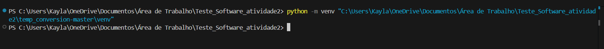

2. Ativação do Ambiente Virtual:
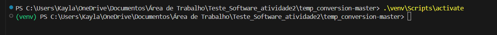

## Pytest

1. Instalação das dependências utilizando o comando: 
`
pip install -r requirements.txt
`
2. Executando testes com pytest e verificando a cobertura de código:
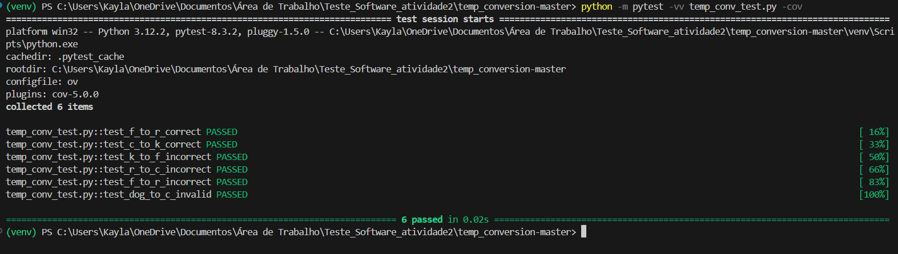

3. Gerando relatório de cobertura em HTML:
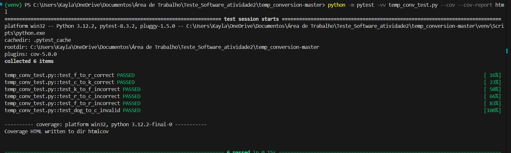

4. Relatório gerado:
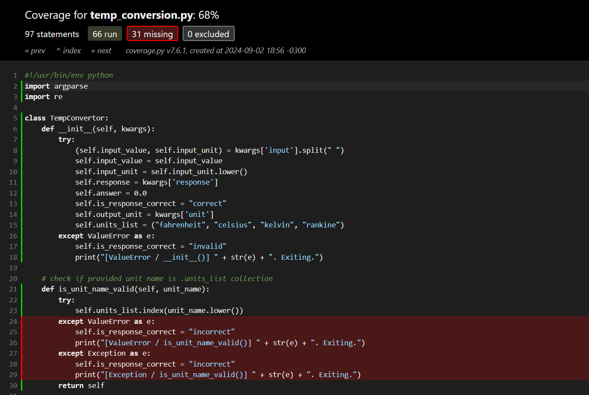
## Teste de Mutação
1. Executando o teste de mutação:
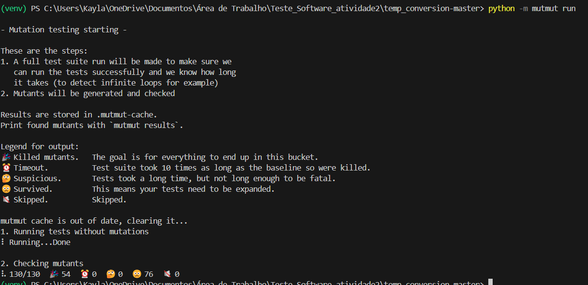

Ao se analisar a imagem acima, percebe-se que há um total de 130 mutantes gerados e testados durante a execução do mutmut. Desses 130 mutantes, 54 foram eliminados com sucesso, ou seja, os testes conseguiram detectar as alterações introduzidas por esses mutantes. Contudo, 76 mutantes sobreviveram, isto é, os testes existentes não foram suficientes para capturar as mudanças realizadas, sugerindo que pode haver lacunas na cobertura dos testes. 

2.Gerando o relatório HTML dos resultados de mutação com o comando `python -m mutmut html`::
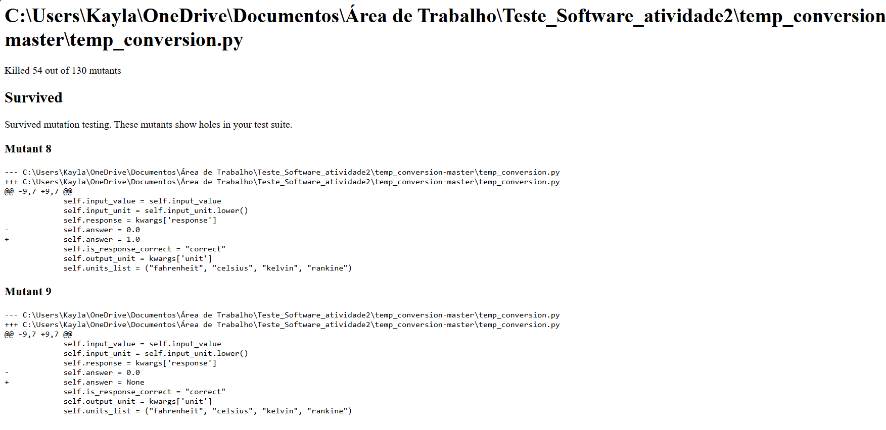

## Novo Caso de Teste

Para eliminar os mutantes abaixo:
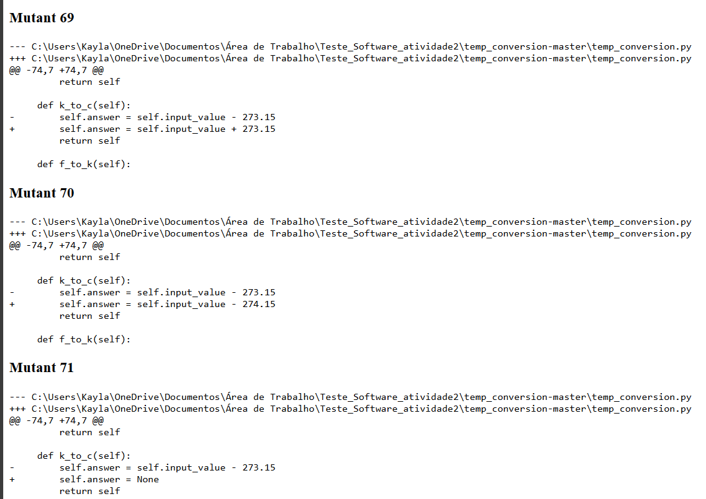
Foi adicionado um novo caso de teste para verificar a conversão de temperatura de Kelvin para Celsius:
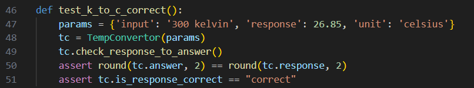
Após adição desse caso de teste, foi feito um novo teste:
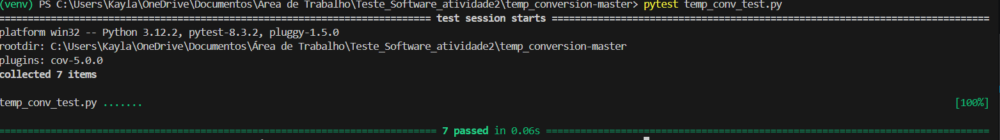
Logo, foi realizado um novo teste de mutação:
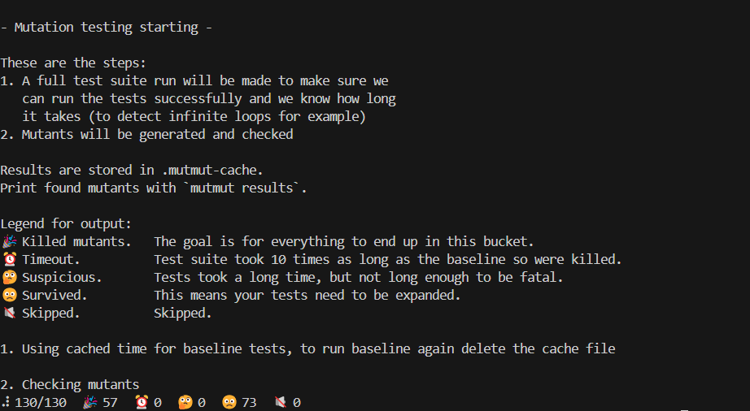

Ao se analisar a imagem acima, percebe-se que, após a alteração no caso de teste para a conversão de Kelvin para Celsius, o número de mutantes sobreviventes diminuiu. Inicialmente, o resultado mostrava 54 mutantes sobreviventes e 76 mortos. Com a inclusão do novo caso de teste, o número de mutantes sobreviventes aumentou para 57, enquanto o número de mutantes mortos reduziu para 73. Assim deve gerar um novo relatório do teste mutação  executando o comando `python -m mutmut html`:
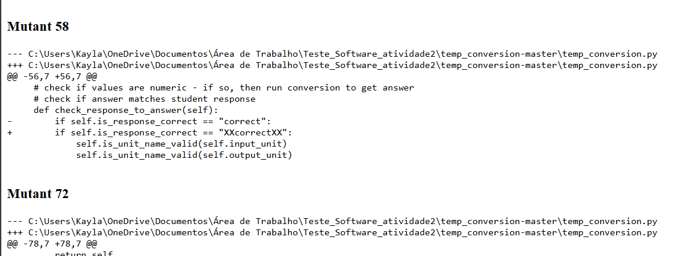
Ao se observar o relatório gerado pelo teste de mutação que os mutantes 69, 70 e 71 foram eliminados.
